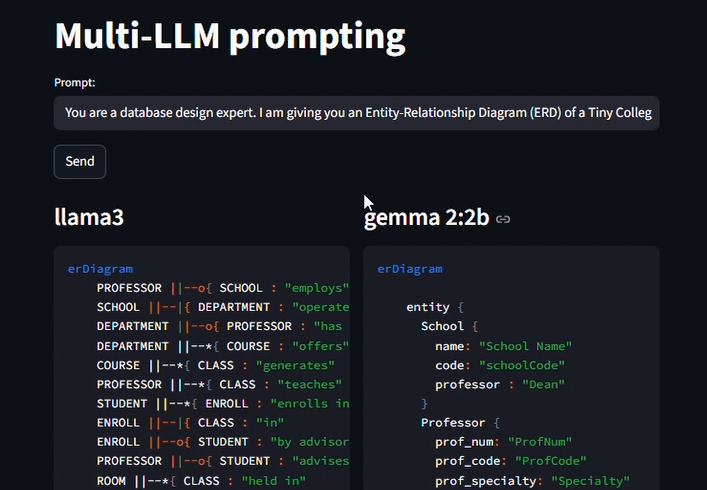
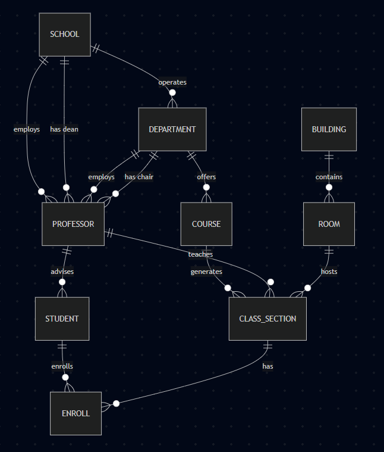

## University Database ER Diagram (Mermaid)

[Demo Video: Prompting the LLMs](https://youtu.be/hyHH51993_k)

[Demo Video: Mermaid-Code_to_ER-Diagram](demo/demo-video2.mp4)

### Output

This project demonstrates the design and visualisation of a **University Database ER-Diagram** using **Mermaid ER syntax**. The ER diagram models core academic entities such as schools, departments, courses, professors, students, and enrollments, along with their relationships.
The Mermaid code is rendered using an online Mermaid-compatible ER diagram visualisation website.

### Objective
* To model a realistic __university academic database__ using ER concepts
* To visualize entity relationships using __Mermaid ER diagrams__
* To understand cardinalities, associative entities, and role-based relationships

### Entities Modelled
The ER diagram includes the following entities:
* __SCHOOL__ – Represents a university or academic school
* __DEPARTMENT__ – Academic departments within a school
* __COURSE__ – Courses offered by departments
* __CLASS_SECTION__ – Specific offerings of a course
* __PROFESSOR__ – Faculty members
* __STUDENT__ – Enrolled students
* __ENROLL__ – Associative entity between students and class sections
* __BUILDING__ – Campus buildings
* __ROOM__ – Rooms within buildings

### Key Relationships
* A **school operates multiple departments**
* A **department offers multiple courses**
* A **course generates multiple class sections**
* A **professor teaches class sections** and **advises students**
* A **student enrolls in class sections** (via ENROLL)
* A **school has a dean** and **departments have chairs** (both professors)
* **Buildings contain rooms**, and **rooms host class sections**

### Step-by-Step Instructions
#### Step 1: Copy the Mermaid ER Code from either llama3 or gemma2:2b
* Whichever is closer to the actual mermaid code
#### Step 2: Open a Mermaid ER Diagram Website
* Open any website that supports Mermaid ER diagrams (for example, a Mermaid live editor or ER diagram visualizer).
#### Step 3: Paste the Code
* Paste the copied Mermaid code into the editor panel
* Ensure the diagram type is set to **ER Diagram** or supports `erDiagram`
#### Step 4: Render the Diagram
* Click **Render / Preview / Generate Diagram**
* The ER diagram with entities and relationships should appear visually
#### Step 5: Verify Relationships
* Cardinalities (`||`, `o{`) are rendered correctly
* `ENROLL` appears as an associative entity
* `CLASS_SECTION` is used instead of `CLASS` (to avoid Mermaid keyword conflicts)

